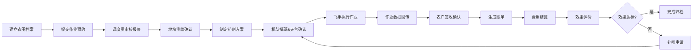

## 1. 产品概述

农业植保无人机服务管理平台，面向农场、合作社和飞防服务队，提供全流程作业管理解决方案。通过数字化管理提升植保作业效率，降低运营成本。

- 核心目标：实现植保作业全流程数字化，从农田档案建立到效果评价的闭环管理
- 目标用户：农场主、合作社管理员、飞防服务队调度员、飞手、农户
- 市场价值：解决传统植保作业管理混乱、数据缺失、核算困难等痛点

## 2. 核心功能

### 2.1 用户角色

| 角色 | 注册方式 | 核心权限 |
|------|----------|----------|
| 系统管理员 | 后台创建 | 全系统管理、用户权限配置 |
| 农场/合作社管理员 | 注册申请 | 农田档案管理、作业预约、数据统计 |
| 飞防队调度员 | 注册申请 | 机队排班、作业派工、药剂管理、费用结算 |
| 飞手 | 邀请注册 | 作业执行、回传数据、照片上传 |
| 农户 | 注册申请 | 作业查看、签收确认、效果评价 |

### 2.2 功能模块

1. **农田档案**: 地块信息管理、边界绘制、作物周期、病虫害登记
2. **作业预约**: 服务申请、亩数核算、服务报价、作业计划
3. **地块测绘**: 边界绘制、面积测算、GIS展示、地形标注
4. **药剂管理**: 药剂库存、配比方案、用量登记、安全提醒
5. **机队排班**: 无人机管理、飞手派工、路线确认、天气窗口
6. **作业回传**: 实时进度、照片上传、面积复核、作业轨迹
7. **费用结算**: 账单生成、欠款提醒、支付记录、发票管理
8. **效果评价**: 农户签收、效果评分、补喷申请、服务统计

### 2.3 页面详情

| 页面名称 | 模块名称 | 功能描述 |
|----------|----------|----------|
| 农田档案 | 地块列表 | 展示所有农田地块，支持搜索筛选 |
| 农田档案 | 地块详情 | 查看地块信息、历史作业、作物生长记录 |
| 农田档案 | 边界绘制 | 交互式地图绘制地块边界，自动计算面积 |
| 农田档案 | 作物周期 | 记录播种、施肥、生长阶段等时间节点 |
| 农田档案 | 病虫害登记 | 记录病虫害发生情况、防治措施、效果评估 |
| 作业预约 | 预约列表 | 展示所有作业预约申请及状态 |
| 作业预约 | 新建预约 | 选择地块、服务类型、期望时间 |
| 作业预约 | 亩数核算 | 根据地块面积和服务类型核算作业量 |
| 作业预约 | 服务报价 | 自动计算服务费用，支持调整 |
| 地块测绘 | 测绘任务 | 待测绘、已测绘任务列表 |
| 地块测绘 | 边界编辑 | 多边形绘制工具、面积自动计算 |
| 地块测绘 | 地图展示 | 卫星地图/标准地图切换，GIS展示 |
| 药剂管理 | 药剂库存 | 药剂分类、库存数量、效期管理 |
| 药剂管理 | 配比方案 | 不同作物/病虫害的药剂配比模板 |
| 药剂管理 | 用量登记 | 作业实际用药量记录、库存扣减 |
| 机队排班 | 无人机管理 | 无人机状态、维护记录、续航信息 |
| 机队排班 | 飞手管理 | 飞手信息、资质、作业记录 |
| 机队排班 | 排班日历 | 可视化排班表，拖拽调整 |
| 机队排班 | 天气窗口 | 作业天气条件提示，适宜度评估 |
| 机队排班 | 路线确认 | 作业路线规划、避障点标注 |
| 作业回传 | 作业列表 | 进行中、已完成作业列表 |
| 作业回传 | 实时进度 | 作业进度条、已完成面积、剩余时间 |
| 作业回传 | 照片上传 | 作业现场照片、视频上传 |
| 作业回传 | 面积复核 | 实际作业面积与预约面积对比 |
| 费用结算 | 账单列表 | 所有账单、待支付、已支付筛选 |
| 费用结算 | 账单详情 | 费用明细、服务项目、税费 |
| 费用结算 | 欠款提醒 | 逾期账单提醒、催款记录 |
| 费用结算 | 季节统计 | 按季度/年度统计营收、作业量 |
| 效果评价 | 评价列表 | 所有作业评价、评分统计 |
| 效果评价 | 农户签收 | 作业完成确认、签字功能 |
| 效果评价 | 补喷申请 | 效果不达标时的补喷申请流程 |
| 效果评价 | 服务统计 | 满意度、好评率、补喷率统计 |

## 3. 核心流程

### 3.1 作业全流程

用户创建农田档案 → 提交作业预约 → 调度员审核报价 → 确认后进行地块测绘 → 制定药剂方案 → 机队排班（考虑天气窗口）→ 飞手执行作业 → 作业数据回传（照片、轨迹、面积）→ 农户签收确认 → 生成账单 → 费用结算 → 效果评价 → （如需补喷）创建补喷任务

## 4. 用户界面设计

### 4.1 设计风格

- **主色调**: 农业绿 (#2E7D32) 搭配大地棕 (#795548)，体现农业主题
- **辅助色**: 天空蓝 (#42A5F5) 用于无人机、天空相关元素；橙色 (#FF9800) 用于警示、提醒
- **按钮风格**: 圆角矩形，主色填充带轻微阴影，悬停有上浮效果
- **字体**: 标题使用 Noto Sans SC Bold，正文使用 Noto Sans SC Regular，清晰易读
- **布局风格**: 侧边导航 + 主内容区，卡片式布局，数据可视化图表
- **图标风格**: 线性图标为主，农业相关元素（作物、无人机、田野）

### 4.2 页面设计概览

| 页面名称 | 模块名称 | UI元素 |
|----------|----------|--------|
| 农田档案 | 地块列表 | 数据表格+地图预览，绿色主题卡片，筛选栏 |
| 作业预约 | 预约表单 | 分步表单，时间选择器，价格计算器 |
| 地块测绘 | 地图编辑 | 全屏地图，绘制工具栏，面积实时显示 |
| 药剂管理 | 库存看板 | 分类标签，库存卡片，库存预警指示器 |
| 机队排班 | 排班日历 | 周视图日历，无人机状态卡片，天气Widget |
| 作业回传 | 作业详情 | 进度条，照片墙，轨迹地图，数据仪表盘 |
| 费用结算 | 账单中心 | 统计卡片，账单列表，支付状态标签 |
| 效果评价 | 评价看板 | 评分仪表盘，评价列表，满意度趋势图 |

### 4.3 响应式设计

- **桌面优先**: 1440px 基准设计，适配 1280px-1920px
- **平板适配**: 侧边栏可折叠，表格转卡片展示
- **移动端**: 底部导航栏，单列布局，触摸优化
- **地图交互**: 支持手势缩放、旋转，绘图工具适配触屏

### 4.4 动效设计

- 页面切换: 淡入淡出 + 轻微位移
- 卡片悬停: 轻微上浮 + 阴影加深
- 数据加载: 骨架屏 + 渐入效果
- 图表数据: 渐进式动画展示
- 进度更新: 平滑过渡动画
