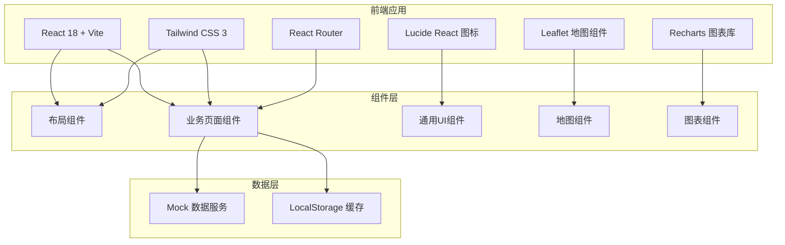
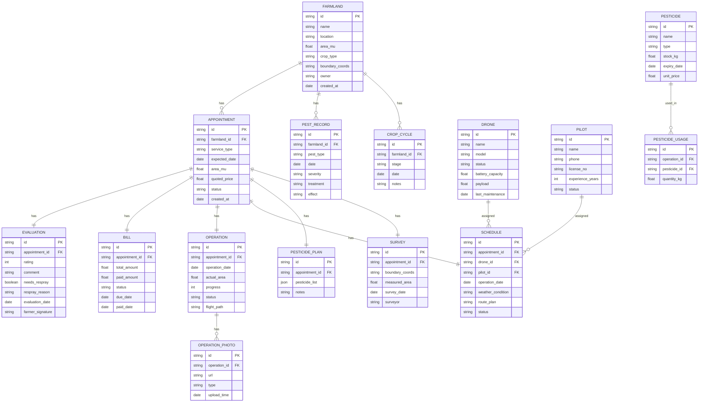

## 1. 架构设计



## 2. 技术描述

- **前端框架**: React@18 + TypeScript
- **构建工具**: Vite@5
- **样式方案**: Tailwind CSS@3
- **路由管理**: React Router DOM@6
- **图表库**: Recharts@2
- **图标库**: Lucide React@0.344
- **地图组件**: Leaflet + React-Leaflet (用于地块绘制和展示)
- **日期处理**: date-fns@3
- **后端**: 无后端，使用 Mock 数据 + LocalStorage 模拟
- **数据持久化**: LocalStorage 存储用户操作数据

## 3. 路由定义

| 路由 | 页面名称 | 用途 |
|------|----------|------|
| / | 首页/仪表盘 | 数据概览、快捷入口 |
| /farmlands | 农田档案 | 地块列表、详情、作物周期、病虫害 |
| /appointments | 作业预约 | 预约列表、新建预约、报价核算 |
| /surveying | 地块测绘 | 测绘任务、边界绘制、面积计算 |
| /pesticides | 药剂管理 | 药剂库存、配比方案、用量登记 |
| /scheduling | 机队排班 | 无人机管理、飞手排班、天气窗口 |
| /operations | 作业回传 | 作业进度、照片上传、面积复核 |
| /billing | 费用结算 | 账单管理、欠款提醒、季节统计 |
| /evaluation | 效果评价 | 农户签收、补喷申请、服务统计 |

## 4. 数据模型

### 4.1 数据模型定义



### 4.2 Mock 数据设计

所有数据使用 TypeScript 接口定义，在 `src/data/mock/` 目录下提供模拟数据：
- 20+ 农田地块数据，包含不同作物类型
- 15+ 作业预约记录，覆盖不同状态
- 10+ 无人机和飞手数据
- 20+ 药剂库存数据
- 完整的作业流程示例数据

## 5. 目录结构

```
src/
├── components/          # 通用组件
│   ├── layout/         # 布局组件
│   │   ├── Sidebar.tsx
│   │   ├── Header.tsx
│   │   └── MainLayout.tsx
│   ├── ui/             # UI基础组件
│   │   ├── Button.tsx
│   │   ├── Card.tsx
│   │   ├── Table.tsx
│   │   ├── Modal.tsx
│   │   ├── ProgressBar.tsx
│   │   └── StatCard.tsx
│   ├── charts/         # 图表组件
│   └── map/            # 地图组件
├── pages/              # 页面组件
│   ├── Dashboard.tsx
│   ├── Farmlands.tsx
│   ├── Appointments.tsx
│   ├── Surveying.tsx
│   ├── Pesticides.tsx
│   ├── Scheduling.tsx
│   ├── Operations.tsx
│   ├── Billing.tsx
│   └── Evaluation.tsx
├── data/               # 数据和类型
│   ├── types.ts        # TypeScript 类型定义
│   └── mock/           # Mock 数据
├── hooks/              # 自定义 Hooks
├── utils/              # 工具函数
├── App.tsx
├── main.tsx
└── index.css
```

## 6. 核心组件设计

### 6.1 地图组件 (MapEditor)
- 基于 Leaflet 实现交互式地图
- 支持多边形绘制、编辑、删除
- 实时计算面积（亩）
- 卫星图/标准图切换

### 6.2 排班日历 (ScheduleCalendar)
- 周视图展示，支持拖拽调整
- 无人机和飞手资源冲突检测
- 天气信息叠加显示
- 作业状态颜色编码

### 6.3 作业进度仪表盘 (OperationDashboard)
- 实时进度条和数据统计
- 作业轨迹展示
- 照片墙展示
- 面积对比图表

### 6.4 数据统计图表
- 季节服务统计柱状图
- 满意度趋势折线图
- 作业类型占比饼图
- 收入统计仪表盘
